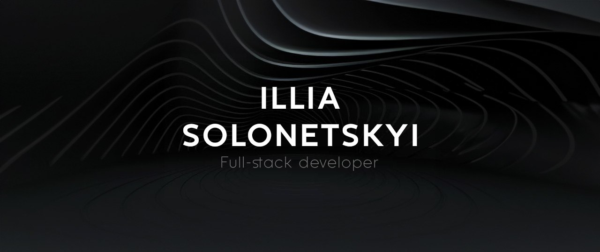

<h1>About me</h1>
<ul>
  <li>📓 One year of programming experience</li>
  <li>💻 Full-stack developer specializing in web development</li>
  <li>🌍 English proficiency at B1 level</li>
  <li>🤝 Team-oriented and collaborative</li>
  <li>🔍 Problem-solving mindset</li>
</ul>

<h1>Skills</h1>

<h3>Front-end</h3>

  
  
  
  
  
  
  
  
  
  

<h3>Back-end</h3>

  
  
  

<h3>Tools</h3>

  
  
  
  
  

<h3>Other skills</h3>

  
  
  

<h3>Learning Now</h3>

  
  

<h1>Projects</h1>

<h3>Nice Gadgets Store</h3>

Sleek and user-friendly shop for browsing mobile phones and other devices. It features a clean interface with search, filter, and sorting options, providing detailed phone specifications and images.

<ul>
  <li>React</li>
  <li>Zustand</li>
  <li>Swiper</li>
  <li>Sass (SCSS)</li>
  <li>BEM</li>
  <li>Node.js</li>
</ul>
<a href="https://fs-mar24-kyrylos-witnesses.github.io/phone-catalog/">Demo</a> | <a href="https://github.com/fs-mar24-kyrylos-witnesses/phone-catalog">Code</a>

<h3>ToDo App</h3>

Task management tool built with React and TypeScript, using local storage for persistence. It allows adding, deleting, and modifying tasks, with filtering options to view all, active, or completed assignments, and is styled with Bulma and FontAwesome.

<ul>
  <li>React</li>
  <li>TypeScript</li>
  <li>FontAwesome</li>
  <li>Bulma</li>
  <li>Sass (SCSS)</li>
  <li>BEM</li>
</ul> 
<a href="https://ilyasolo881.github.io/react_todo-app-with-api/">Demo</a> | <a href="https://github.com/ilyasolo881/ToDo-App">Code</a>

<h3>MyBike Landing Page</h3>

Responsive static website designed to highlight bicycles and related accessories. It features a modern user interface with smooth animations, built using HTML and SCSS. The site serves as an excellent template for bike-related businesses or product showcases.

<ul>
  <li>HTML</li>
  <li>Sass (SCSS)</li>
  <li>BEM</ul>
<a href="https://ilyasolo881.github.io/layout_landing-page/">Demo</a> | <a href="https://github.com/ilyasolo881/MyBike-Landing-page">Code</a>

<h1>My contacts</h1>

  
  
  

